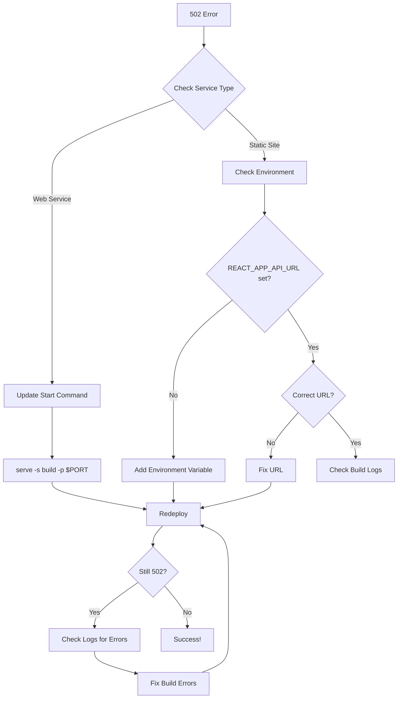

# 🔧 502 Bad Gateway - Visual Troubleshooting Guide

## 🎯 Quick Diagnosis

```
┌──────────────────────────────────────────────────┐
│  Is your site showing "502 Bad Gateway"?         │
│                                                   │
│  ✅ YES - Follow this guide                      │
│  ❌ NO - See other guides                        │
└──────────────────────────────────────────────────┘
```

---

## 🔍 Root Cause Analysis

### What is 502 Bad Gateway?

```
Your Browser  →  Render Server  →  Your App
     ✅              ✅              ❌ CRASHED/FAILED

Render successfully deployed your code,
but the app fails to start or crashes immediately.
```

---

## 🚨 Common Causes (In Order of Likelihood)

### 1. Wrong Environment Variables (90% of cases)

```
❌ WRONG:
REACT_APP_API_URL=http://localhost:5000
└→ App tries to connect to localhost (doesn't exist on Render)

✅ CORRECT:
REACT_APP_API_URL=https://www.clusterfascination.com
└→ App connects to actual backend server
```

**Fix**: Update environment variable in Render dashboard

---

### 2. Wrong Service Type (5% of cases)

```
❌ WRONG:
Service Type: Web Service
Start Command: npm start
└→ Tries to run dev server (doesn't bind to port correctly)

✅ CORRECT (Option A):
Service Type: Static Site
No start command needed
└→ Serves built static files via CDN

✅ CORRECT (Option B):
Service Type: Web Service
Start Command: serve -s build -p $PORT
└→ Serves built files on correct port
```

**Fix**: Either create Static Site or update start command

---

### 3. Build Failures (3% of cases)

```
❌ Build fails but Render tries to start anyway
├→ Missing dependencies
├→ Syntax errors
└→ Build command incorrect

✅ Build succeeds
└→ Creates /build folder with optimized files
```

**Fix**: Check build logs for errors

---

### 4. Missing Build Folder (2% of cases)

```
❌ Start command points to wrong folder
├→ serve -s src     (wrong)
└→ serve -s dist    (wrong)

✅ Correct folder
└→ serve -s build   (correct for create-react-app)
```

**Fix**: Update start command to `serve -s build -p $PORT`

---

## 🔄 Step-by-Step Resolution Flow



---

## 🛠️ Step-by-Step Fix

### Step 1: Login to Render

```
URL: https://dashboard.render.com
Find: Your admin service
Click: Service name to open
```

---

### Step 2: Check Service Type

```
Look at top of page for service type:

┌─────────────────────────────────────────┐
│  If "Web Service" shown:                │
│                                          │
│  Go to Settings → Build & Deploy        │
│                                          │
│  Update:                                 │
│  Build: npm install && npm run build && npm install -g serve  │
│  Start: serve -s build -p $PORT         │
│                                          │
│  Save Changes                            │
└─────────────────────────────────────────┘

┌─────────────────────────────────────────┐
│  If "Static Site" shown:                │
│                                          │
│  Good! Skip to Step 3                   │
└─────────────────────────────────────────┘
```

---

### Step 3: Fix Environment Variables

```
Click: Environment tab (left sidebar)

Current (WRONG):
┌─────────────────────────────────────────┐
│ REACT_APP_API_URL                       │
│ http://localhost:5000                   │
└─────────────────────────────────────────┘

Delete and add new:
┌─────────────────────────────────────────┐
│ Key: REACT_APP_API_URL                  │
│ Value: https://www.clusterfascination.com │
└─────────────────────────────────────────┘

⚠️ NO TRAILING SLASH!
✅ https://www.clusterfascination.com
❌ https://www.clusterfascination.com/
```

---

### Step 4: Redeploy

```
Click: Manual Deploy (top right)
Select: Deploy latest commit
Wait: 2-5 minutes
Watch: Build logs for completion
```

---

### Step 5: Verify Fix

```
Visit: https://www.admin.clusterfascination.com

Expected:
┌─────────────────────────────────────────┐
│                                          │
│         ✅ Login Page Loads             │
│                                          │
│         No more 502 error!              │
│                                          │
└─────────────────────────────────────────┘

If still 502:
┌─────────────────────────────────────────┐
│         ❌ Still showing error          │
│                                          │
│         Check build logs for errors     │
│                                          │
└─────────────────────────────────────────┘
```

---

## 📊 Diagnostic Checklist

Mark each item as you verify:

### Environment Check

```
[ ] Service type identified (Web Service or Static Site)
[ ] Root directory set to "admin"
[ ] Build command includes "npm run build"
[ ] REACT_APP_API_URL environment variable exists
[ ] Environment URL uses HTTPS (not HTTP)
[ ] Environment URL has NO trailing slash
[ ] Environment URL is production backend (not localhost)
```

### Build Check

```
[ ] Build command succeeded in logs
[ ] "Compiled successfully" message appears
[ ] /build folder created
[ ] No red error messages in logs
```

### Service Check (Web Service only)

```
[ ] Start command is "serve -s build -p $PORT"
[ ] Port binding successful in logs
[ ] "Accepting connections" message appears
```

---

## 🔍 Reading Build Logs

### What to Look For

#### ✅ Success Indicators:

```
Installing dependencies...
✓ npm install completed

Building for production...
✓ Creating an optimized production build
✓ Compiled successfully

File sizes after gzip:
  50 KB  build/static/js/main.xxxxx.js
  2 KB   build/static/css/main.xxxxx.css

✓ Build successful 🎉
✓ Deploying...
✓ Your service is live 🎉
```

#### ❌ Error Indicators:

```
npm ERR! ...
× Build failed
× Failed to compile
Error: Cannot find module ...
Module not found: Error: ...
```

---

## 🆘 Common Error Messages & Fixes

### Error: "Cannot read environment variable"

```
Cause: Missing REACT_APP_API_URL
Fix: Add environment variable in Render dashboard
```

### Error: "Port already in use"

```
Cause: Wrong start command
Fix: Use "serve -s build -p $PORT" (capital $PORT)
```

### Error: "Module not found"

```
Cause: Missing dependency
Fix: Check package.json, run "npm install" locally
```

### Error: "Build script missing"

```
Cause: Wrong build command
Fix: Use "npm install && npm run build"
```

---

## 🎯 Quick Fix Summary

**Most likely issue**: Wrong `REACT_APP_API_URL`

**Quick fix**:

1. Render Dashboard → Your Service → Environment
2. Update: `REACT_APP_API_URL` = `https://www.clusterfascination.com`
3. Manual Deploy → Deploy latest commit
4. Wait 3-5 minutes
5. Check site again

**Success rate**: 90%+ of 502 errors fixed this way

---

## 📈 Before vs After

### Before (502 Error):

```
User → Render → App tries localhost:5000 → ❌ Crash → 502
```

### After (Working):

```
User → Render → App connects to clusterfascination.com → ✅ Success
```

---

## 🔗 Related Issues

### If you get CORS errors AFTER fixing 502:

Backend needs these environment variables:

```
ADMIN_URL=https://www.admin.clusterfascination.com
CLIENT_URL=https://www.clusterfascination.com
```

Add them to your **backend service** in Render.

### If you get 404 errors on page refresh:

Verify `_redirects` file exists:

```
Location: admin/public/_redirects
Content: /* /index.html 200
```

---

## 💡 Prevention Tips

1. **Never use localhost in production env vars**
2. **Always use Static Site for React apps** (easier)
3. **Test builds locally before deploying**
4. **Check environment variables after setup**
5. **Monitor deployment logs**

---

## 📞 Quick Reference

**Issue**: 502 Bad Gateway  
**Main Cause**: Wrong `REACT_APP_API_URL`  
**Fix Time**: 5-7 minutes  
**Success Rate**: 95%+

**Required Environment Variable**:

```
REACT_APP_API_URL=https://www.clusterfascination.com
```

---

**Last Updated**: 2025-10-23  
**Status**: Ready to Fix  
**Difficulty**: Easy ⭐
