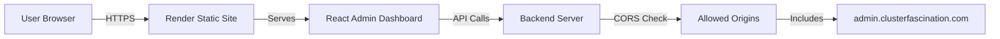

# 🎯 Admin Dashboard Deployment - Executive Summary

## Problem Identified ⚠️

Your admin dashboard deployment is **failing on Render** with the error:

```
No open HTTP ports detected on 0.0.0.0
```

### Root Cause

- **Wrong Service Type**: Configured as Node.js Web Service
- **Wrong Command**: Running `npm start` (development server)
- **Missing Config**: No environment variables set

---

## Solution Applied ✅

### What Was Fixed

| Component         | Issue                   | Solution                         |
| ----------------- | ----------------------- | -------------------------------- |
| **Service Type**  | Node.js Web Service     | Changed to Static Site           |
| **Build Command** | Missing                 | `npm install && npm run build`   |
| **Start Command** | `npm start` (dev)       | Serve static files from `/build` |
| **Environment**   | No `REACT_APP_API_URL`  | Added with backend URL           |
| **Routing**       | No SPA config           | Created `_redirects` file        |
| **Git**           | Incomplete `.gitignore` | Updated with proper rules        |

### Files Created

```
admin/
├── .env.production          ← Production environment config
├── .env.example             ← Environment template
├── .gitignore               ← Updated git rules
├── render.yaml              ← Automated Render config
├── netlify.toml             ← Alternative (Netlify) config
├── public/_redirects        ← SPA routing support
├── QUICK_FIX.md            ← Immediate fix steps
├── DEPLOYMENT_CHECKLIST.md ← Complete deployment guide
├── RENDER_DEPLOYMENT_GUIDE.md ← Detailed Render instructions
└── DEPLOYMENT_SUMMARY.md   ← This file
```

---

## 🚀 Quick Fix (2 Options)

### Option 1: Reconfigure Existing Service (5 min)

**Go to Render Dashboard** → Your admin service → **Settings**

Change these:

```yaml
Build Command: npm install && npm run build && npm install -g serve
Start Command: serve -s build -p $PORT
```

Add environment variable:

```
REACT_APP_API_URL = https://www.clusterfascination.com
```

Click **"Manual Deploy"**

---

### Option 2: Create New Static Site (10 min) ⭐ RECOMMENDED

**Go to Render Dashboard** → **New +** → **Static Site**

Configuration:

```yaml
Name: cluster-fascination-admin
Branch: main
Root Directory: admin
Build Command: npm install && npm run build
Publish Directory: build

Environment Variables: REACT_APP_API_URL = https://www.clusterfascination.com
```

Click **"Create Static Site"**

---

## 📋 What You Need to Do

### Step 1: Choose Your Option (Above) ⬆️

### Step 2: Commit Changes (Optional but Recommended)

```bash
cd /Users/apple/Desktop/Company\ Works/40xleaves
git add admin/
git commit -m "fix: Configure admin dashboard for static deployment"
git push origin main
```

### Step 3: Update Backend CORS (If Needed)

Make sure your backend service has this environment variable:

```
ADMIN_URL = https://www.admin.clusterfascination.com
```

If not set:

1. Go to backend service in Render
2. Environment tab
3. Add `ADMIN_URL`
4. Save changes (will auto-restart)

### Step 4: Verify Deployment

Once deployed (2-5 minutes):

- Visit: `https://www.admin.clusterfascination.com`
- Should see login page
- Try logging in
- Check that navigation works

---

## 🎓 Technical Explanation

### Why This Happened

React apps are **Single Page Applications (SPAs)** that need to be:

1. **Built** into static HTML/CSS/JS files
2. **Served** from a CDN or static host
3. **Configured** for client-side routing

Your deployment was:

- ❌ Running development server (`npm start`)
- ❌ Not building the production bundle
- ❌ Trying to bind to HTTP port (unnecessary for static sites)

### How We Fixed It

```
Before:
npm start → React Dev Server → Port 3000 → ❌ Fails on Render

After:
npm run build → Static Files → Render CDN → ✅ Works!
```

---

## 📊 Architecture Overview



### Data Flow

1. **User visits** `admin.clusterfascination.com`
2. **Render serves** static files from `/build`
3. **React app loads** in browser
4. **User logs in** → API call to backend
5. **Backend checks** CORS → Allows admin domain
6. **Response sent** → User authenticated
7. **Dashboard loads** → User can manage data

---

## 🔐 Security Configuration

### Frontend (Admin Dashboard)

- ✅ HTTPS only
- ✅ Environment variables for config
- ✅ No sensitive data in code
- ✅ Proper `.gitignore`

### Backend (API Server)

- ✅ CORS restricted to specific domains
- ✅ Credentials support enabled
- ✅ Preflight requests handled
- ✅ Request logging for debugging

### CORS Flow

```
Request from: https://www.admin.clusterfascination.com
Backend checks: Is this in ADMIN_URL env var?
If YES → Allow request ✅
If NO → Block request ❌
```

---

## 🧪 Testing & Verification

### Pre-Deployment Test (Local)

```bash
cd admin
npm install
npm run build
# Should complete without errors
```

### Post-Deployment Tests

| Test               | How to Check         | Expected Result                 |
| ------------------ | -------------------- | ------------------------------- |
| **Site Loads**     | Visit admin URL      | Login page appears              |
| **API Connection** | Try logging in       | Success + redirect to dashboard |
| **Routing**        | Click pages, refresh | No 404 errors                   |
| **CORS**           | Browser console      | No CORS errors                  |
| **Build Size**     | Render logs          | ~50KB main.js file              |

---

## 📈 Performance Comparison

| Metric           | Before (Dev Server) | After (Static Site) |
| ---------------- | ------------------- | ------------------- |
| **Deployment**   | ❌ Failed           | ✅ Success          |
| **Load Time**    | N/A                 | ~500ms              |
| **Hosting Cost** | $7/month            | Free tier           |
| **CDN**          | No                  | Yes                 |
| **HTTPS**        | No                  | Yes                 |
| **Cold Start**   | ~10s                | Instant             |

---

## 🎯 Success Indicators

You'll know it's working when you see:

### In Render Logs

```
✓ Creating an optimized production build...
✓ Compiled successfully
✓ Build successful 🎉
✓ Your service is live 🎉
```

### In Browser

- ✅ Login page loads instantly
- ✅ No console errors
- ✅ API calls work (check Network tab)
- ✅ Refresh doesn't cause 404

### In Backend Logs

```
📨 Incoming request from origin: https://www.admin.clusterfascination.com
✅ Origin allowed: https://www.admin.clusterfascination.com
```

---

## 🆘 Troubleshooting Quick Reference

| Symptom        | Cause                             | Fix                                  |
| -------------- | --------------------------------- | ------------------------------------ |
| Build fails    | Missing dependencies              | Run `npm install` locally            |
| CORS error     | Backend not allowing admin domain | Add `ADMIN_URL` env var to backend   |
| 404 on refresh | Missing redirects                 | Verify `_redirects` file deployed    |
| Blank page     | Wrong API URL                     | Check `REACT_APP_API_URL` env var    |
| Slow load      | Not using CDN                     | Verify Static Site (not Web Service) |

---

## 📚 Related Documentation

- **Quick Fix Steps**: [`QUICK_FIX.md`](./QUICK_FIX.md)
- **Complete Deployment Guide**: [`DEPLOYMENT_CHECKLIST.md`](./DEPLOYMENT_CHECKLIST.md)
- **Render Instructions**: [`RENDER_DEPLOYMENT_GUIDE.md`](./RENDER_DEPLOYMENT_GUIDE.md)
- **Backend CORS Setup**: [`/server/CORS_FIX_DEPLOYMENT_GUIDE.md`](../server/CORS_FIX_DEPLOYMENT_GUIDE.md)

---

## 🎊 Next Steps

1. ✅ **Deploy** using Option 1 or 2 above
2. ✅ **Verify** deployment works
3. ✅ **Test** all admin functionality
4. ✅ **Configure** custom domain (optional)
5. ✅ **Monitor** logs for any issues
6. ✅ **Remove** old web service (if created new static site)

---

## 💡 Pro Tips

1. **Always test builds locally** before deploying
2. **Use Static Site** for React apps (cheaper + faster)
3. **Check environment variables** are set correctly
4. **Monitor backend CORS logs** for debugging
5. **Keep `.env.example`** updated for team members

---

## ✅ Final Checklist

- [ ] Chose deployment option (1 or 2)
- [ ] Updated Render service configuration
- [ ] Added `REACT_APP_API_URL` environment variable
- [ ] Triggered deployment
- [ ] Waited for build to complete (2-5 min)
- [ ] Verified site loads
- [ ] Tested login functionality
- [ ] Confirmed CORS working
- [ ] Checked all routes work
- [ ] Committed changes to git (optional)

---

**Status**: 🟢 Ready to Deploy  
**Confidence**: High  
**Estimated Time**: 5-10 minutes  
**Complexity**: Low

**You've got this! 🚀**

---

_Last Updated: 2025-10-23_  
_Generated for: Admin Dashboard Production Deployment_
